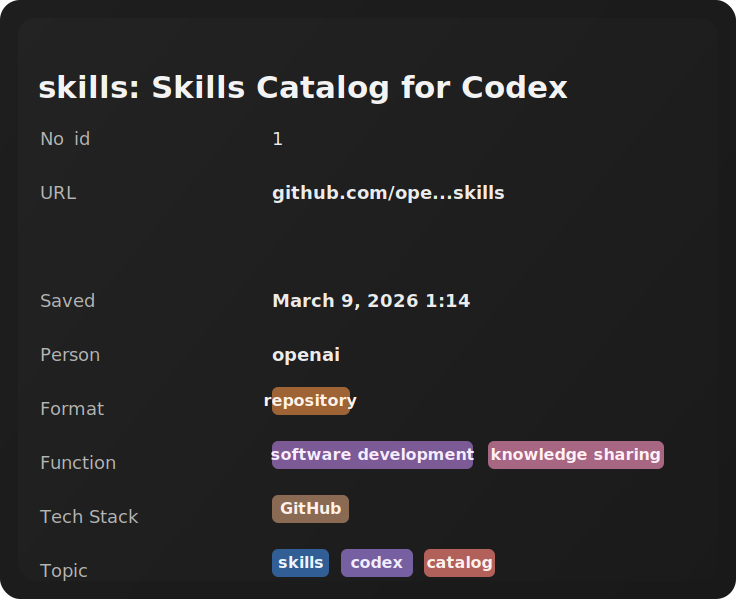

# n8n Smart Bookmark Pipeline


A local `n8n` setup that accepts a link from Telegram, checks duplicates in Postgres, pulls metadata via Firecrawl, classifies the resource with OpenAI, and saves the result to Notion and the local database.

The current repository contents look more like a smart bookmarking pipeline than a Twitter parser. This README describes what is actually in the repo right now.

## Features

- accepts a Telegram message and extracts a URL from it;
- checks whether the link already exists in the `bookmarks` table;
- if the link is new, scrapes the page through Firecrawl;
- extracts factual metadata using a dedicated AI agent;
- assigns `format`, `topic`, `function`, and `tech_stack` facets using values already present in the database;
- turns each saved link into a structured card with human-readable fields and reusable facet groups;
- writes the result into Notion;
- stores the same facets and core fields in Postgres;
- sends a reply back to the user in Telegram.

Facet groups used by the pipeline:

- `format`: what the resource is;
- `topic`: what the resource is about;
- `function`: what the resource is useful for;
- `tech_stack`: named technologies clearly present in the resource.

## Example Card

Example of the kind of bookmark card this pipeline produces:



Example facet output shown in the card:

- `format`: `repository`
- `function`: `software development`, `knowledge sharing`
- `tech_stack`: `GitHub`
- `topic`: `skills`, `codex`, `catalog`

## Architecture

Main flow:

`Telegram -> n8n workflow -> Postgres duplicate check -> Firecrawl -> OpenAI agents -> Notion + Postgres`

Services defined in `docker-compose.yaml`:

- `postgres` based on `postgres:18`;
- `pgadmin` for data inspection at `http://localhost:5050`;
- `n8n` at `http://localhost:5678`.

## Workflow Overview

Main workflow:

- [`bookmarks/workflow/website to bookmark _ AI tags -_ Notion upsert.json`](./bookmarks/workflow/website%20to%20bookmark%20_%20AI%20tags%20-_%20Notion%20upsert.json)

What it does:

1. A Telegram trigger receives a message.
2. A JS node extracts the URL and the remaining user text.
3. The sub-workflow [`bookmarks/workflow/Check link in DB.json`](./bookmarks/workflow/Check%20link%20in%20DB.json) checks whether the URL already exists in Postgres.
4. If the link already exists, the bot replies with `Already exists!`.
5. If the link is new, Firecrawl runs and, in parallel, the workflow loads the library of existing facets from the database.
6. `Agent: info extractor` pulls factual fields such as `Title`, `URL`, `Cover`, `Person`, and `Raw metadata`.
7. `Agent: Facet extractor` assigns facets while trying to reuse values already present in the database.
8. The outputs are merged, then:
   - a page is created in Notion;
   - a local row is inserted into `bookmarks`;
   - the user receives `Nice! Now you have it! ;)`.

## Database

The initialization schema is located at:

- [`bookmarks/db/schema_roll.sql`](./bookmarks/db/schema_roll.sql)

It creates:

- `bkmrk_users` for user configuration and subscription state;
- `bkmrk_user_auth` for Telegram ID mapping;
- `bookmarks` for links and facets;
- GIN indexes for facet arrays;
- `v_user_config` for fast access to user settings.

The `bookmarks` table currently uses these arrays:

- `facet_format`
- `facet_topic`
- `facet_function`
- `facet_tech_stack`

## Repository Structure

```text
.
|-- docker-compose.yaml
|-- bookmarks
|   |-- db
|   |   `-- schema_roll.sql
|   |-- prompts
|   |   |-- Agent Facet extractor
|   |   |-- Agent info extractor
|   |   `-- firecrawl_parser
|   |-- workflow
|   |   |-- Check link in DB.json
|   |   `-- website to bookmark _ AI tags -_ Notion upsert.json
|   `-- json
|       |-- layer1.json
|       `-- layer1_v2.json
|-- agency-agents
|-- n8n_data
|-- pgadmin_data
`-- postgres_data
```

## Quick Start

### 1. Create a local `.env`

Copy `.env.example` to `.env` and replace all placeholder values before starting the stack.

```bash
cp .env.example .env
```

On Windows PowerShell:

```powershell
Copy-Item .env.example .env
```

### 2. Start the services

```bash
docker compose up -d
```

After startup:

- `n8n`: `http://localhost:5678`
- `pgAdmin`: `http://localhost:5050`

Ports are still defined through `.env`, but credentials and the encryption key are no longer hardcoded in `docker-compose.yaml`.

### 3. Import workflows into n8n

Import both JSON files from `bookmarks/workflow`.

Recommended order:

1. `Check link in DB.json`
2. `website to bookmark _ AI tags -_ Notion upsert.json`

### 4. Configure credentials in n8n

You need working credentials for:

- Telegram Bot API
- OpenAI
- Firecrawl
- Postgres
- Notion

The exported workflow JSON files in this repo are sanitized. After import, replace the placeholder credential IDs and names with your own n8n credentials.

### 5. Check the webhook URL

The compose file now reads the webhook URL from `.env`:

```env
WEBHOOK_URL=https://your-current-tunnel.example.com
```

If this address is no longer valid, the Telegram trigger will not receive incoming messages correctly. For local development, this value should be updated to match the current tunnel.
